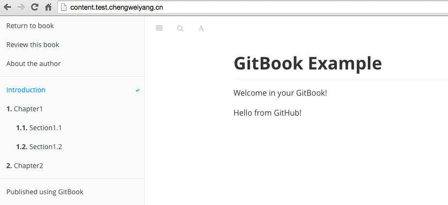

# 綁定域名

除了可以使用類似 `http://chengweiv5.gitbooks.io/test/content/index.html` 地址訪問用戶的書籍外，還可以為每本書綁定域名，前提是用戶有自己的域名。

這裡繼續以 test book 為例，將其綁定到 test.chengweiyang.cn，這樣，用戶就可以通過新的域名訪問本書！

## 修改書籍的域名配置

首先，在書籍的屬性頁面找到 "Domain Names" 屬性，如下圖：


點擊 "Domain Names"，進入配置頁面，如下圖：


分別為書籍的封面和內容設置一個域名，如下圖所示：


需要注意的是：這裡只能是一個合法的域名，不能是域名下的某個地址，例如：`chengweiyang.cn/test`, `chengweiyang.cn/test/content`。

## 配置域名

將書籍的訪問地址修改為個人的域名後，還需要讓個人域名能夠找到書籍的內容，這裡參考 [gitbook 文檔](http://help.gitbook.io/book/domains.html) 來配置。主要的是要為你的域名添加子域名 CNAME，並且指向 gitbook.com，然後等待域名生效，可能需要幾分鐘到幾小時不等。

這裡不再演示怎樣為你的域名添加 CNAME 記錄，各個域名服務商提供的工具可能不同，所以用戶可以諮詢域名提供商獲取幫助。

## 驗證

可以使用 `nslookup` 來驗證是否解析成功：

```bash
$ nslookup test.chengweiyang.cn
Server:         10.11.50.66
Address:        10.11.50.66#53

Non-authoritative answer:
test.chengweiyang.cn    canonical name = www.gitbook.com.
www.gitbook.com canonical name = saga-4658.herokussl.com.
saga-4658.herokussl.com canonical name = elb049689-1604000308.us-east-1.elb.amazonaws.com.
Name:   elb049689-1604000308.us-east-1.elb.amazonaws.com
Address: 23.21.177.67
Name:   elb049689-1604000308.us-east-1.elb.amazonaws.com
Address: 23.21.212.67
Name:   elb049689-1604000308.us-east-1.elb.amazonaws.com
Address: 23.21.54.142

$ nslookup content.test.chengweiyang.cn
Server:         10.11.50.65
Address:        10.11.50.65#53

Non-authoritative answer:
content.test.chengweiyang.cn    canonical name = www.gitbook.com.
www.gitbook.com canonical name = saga-4658.herokussl.com.
saga-4658.herokussl.com canonical name = elb049689-1604000308.us-east-1.elb.amazonaws.com.
Name:   elb049689-1604000308.us-east-1.elb.amazonaws.com
Address: 23.21.212.67
Name:   elb049689-1604000308.us-east-1.elb.amazonaws.com
Address: 23.21.54.142
Name:   elb049689-1604000308.us-east-1.elb.amazonaws.com
Address: 23.21.177.67
```

現在，將瀏覽器指向 `http://test.chengweiyang.cn` 就可以看到書籍了。


點擊 "READ" 按鈕，或者直接將瀏覽器指向 `http://content.test.chengweiyang.cn` 就可以閱讀書籍內容了！


