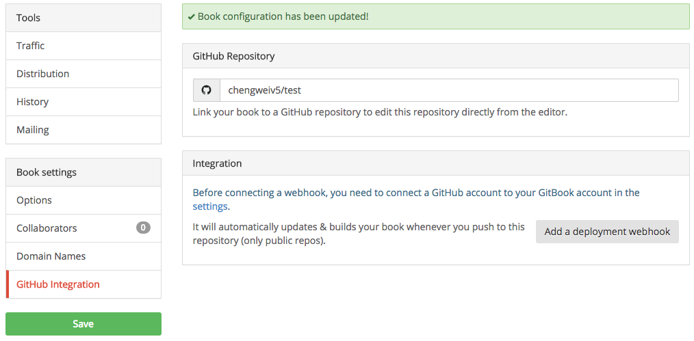
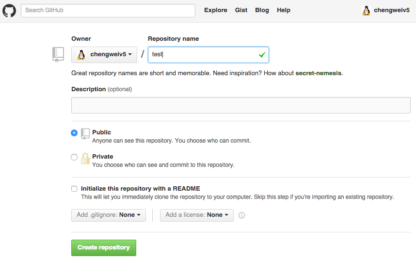

# GitHub 集成

GitBook.com 為每本書籍都創建了一個 Git 項目，並且使用這個 Git 項目來管理書籍源碼（注意：這裡的源碼是指所有用戶提交的內容）。正如在 [編輯書籍](/edit.html) 中介紹的那樣，我們可以通過向書籍的 Git 項目提交內容來更新書籍。

另外，GitBook.com 還可以集成 [GitHub](https://github.com)，所以用戶可以將書籍的源碼通過 GitHub 上的項目來管理，這樣可以使用 GitHub 帶來的各種優點，例如：

- 其它用戶可以 fork
- 用戶可以點贊，獲得更新提醒
- 用戶可以貢獻自己的內容

等等。

這裡，接著之前的實例，將使用 GitHub 中的項目來替代 GitBook.com 上的項目 `https://git.gitbook.com/chengweiv5/test.git`。

## 使用 GitHub 上的項目

首先，將書籍的 Git 項目設置為 GitHub 上的項目，進入書籍屬性頁面，找到 "GitHub" 圖標，如下圖：


輸入將要使用的 GitHub 上的項目，注意是公開的項目，如下圖：


保存後，可以看到之前不可點擊的 "Add a deployment webhook" 按鈕已經可以點擊了，這個按鈕表示：每當用戶配置的 GitHub 上的項目更新時，自動更新書籍！



## 創建 GitHub 項目

假設上面配置的 GitHub 中的項目並不存在，那麼，首先，登陸 GitHub，然後創建一個 test 項目，如下圖所示：



## 導入代碼

現在，將書籍原來的 Git 項目內容導入到新建的 GitHub 中的項目中，假設已經將 `https://git.gitbook.com/chengweiv5/test.git` 項目克隆到了 test 目錄：

```bash
$ cd test

$ git remote add github https://github.com/chengweiv5/test.git

$ git push -u github master
Counting objects: 31, done.
Delta compression using up to 4 threads.
Compressing objects: 100% (26/26), done.
Writing objects: 100% (31/31), 6.58 KiB | 0 bytes/s, done.
Total 31 (delta 7), reused 0 (delta 0)
To https://github.com/chengweiv5/test.git
 * [new branch]      master -> master
Branch master set up to track remote branch master from github.
```

`git push` 命令中的 `-u` 表示將本地 master 分支的上游分支設置為 github/master，所以以後修改了本地 master 分支後，`git push` 將推送到 github 上，而非原來的 `https://git.gitbook.com/chengweiv5/test.git`。

## 更新書籍

現在，可以通過提交變更到 GitHub 項目中來更新書籍了，例如：

```bash
$ git diff
diff --git a/README.md b/README.md
index e7b10b8..c776a52 100644
--- a/README.md
+++ b/README.md
@@ -2,3 +2,5 @@ GitBook Example
 =======
 
 Welcome in your GitBook!
+
+Hello from GitHub!

$ git commit  -asm "hello from github"
[master d985a79] hello from github
 1 file changed, 2 insertions(+)

$ git push
Counting objects: 3, done.
Delta compression using up to 4 threads.
Compressing objects: 100% (3/3), done.
Writing objects: 100% (3/3), 392 bytes | 0 bytes/s, done.
Total 3 (delta 0), reused 0 (delta 0)
To https://github.com/chengweiv5/test.git
   b6a8b3f..d985a79  master -> master
```


