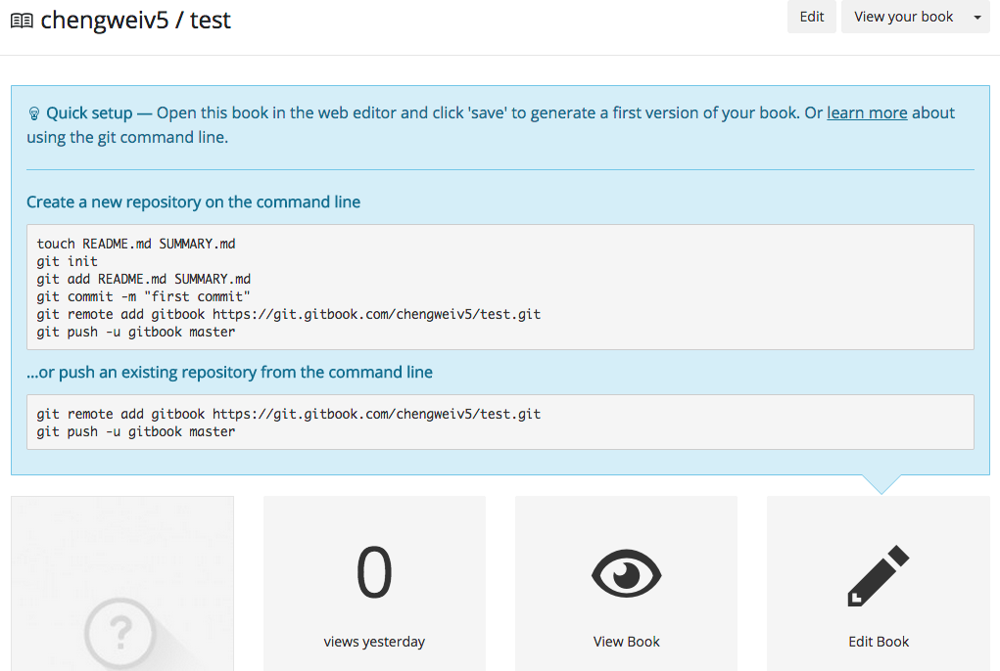
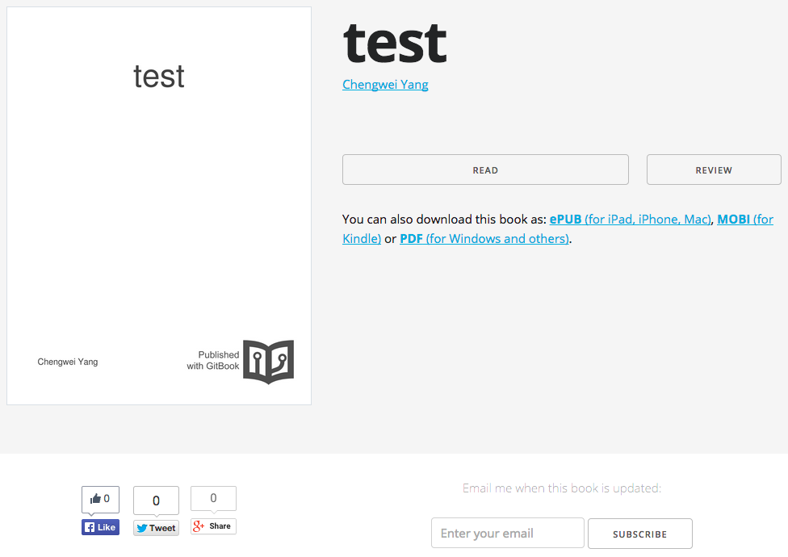

# 編輯書籍

在創建了書籍後，可以使用免費的在線編輯器進行編輯，也可以使用 [gitbook editor](https://github.com/GitbookIO/editor) 編輯，甚至使用任何喜歡的文本編輯器來編輯，例如：Vim。

## 在線編輯

進入到書籍的屬性頁面後，點擊 "Edit Book" 按鈕即可打開在線編輯器。

GitBook 的在線編輯器對於國內用戶來說，很可能不能訪問，所以最好還是下載 [gitbook editor](https://github.com/GitbookIO/editor) 到本地，安裝後使用，或者使用自己喜歡的文本編輯器直接編輯。

## gitbook editor

gitbook editor 實際上就是一個本地應用版的在線編輯器，使用方式和在線編輯器類似，所見即所得，這裡不再介紹，讀者可以參考 [gitbook 使用](/basic-usage/README.html) 中的內容。

## Git & Markdown

另一種方式，是直接使用文本編輯器，編寫 Markdown 文檔，然後，使用 Git 提交到書籍的遠程項目，當然，提交前，最好在本地使用 `gitbook` 預覽效果；提交後，GitBook.com 會自動生成更新書籍的內容。

### 克隆書籍源代碼

GitBook.com 上的每本書都使用 Git 項目來管理，所以，這裡首先需要克隆需要編輯書籍的 Git 項目，登陸 GitBook.com 後，跳轉到書籍的屬性頁面，如下圖所示：


點擊 "Edit Book" 上方的 "learn more"，將會展現此書籍的 Git 項目地址，以及簡單的使用方法，如下圖所示：



使用如下命令，克隆書籍的源代碼：

```bash
$ git clone https://git.gitbook.com/chengweiv5/test.git
Cloning into 'test'...
remote: Counting objects: 28, done.
remote: Compressing objects: 100% (17/17), done.
remote: Total 28 (delta 6), reused 28 (delta 6)
Unpacking objects: 100% (28/28), done.
Checking connectivity... done.

$ cd test/

$ ls
README.md  SUMMARY.md

$ git log --oneline 
07bde6c Cleanup example
6d368db Add _book to gitignore
20779f5 Add explanation in README.md
1b5b1a6 Create chapter-1/ARTICLE1.md
77b1858 Add help message in SUMMARY.md
210e3fe Create chapter-1/README.md
5570112 Create SUMMARY.md
2a8a0c3 Initial commit
```

可以看到，創建好的書籍默認已經創建了一些內容，但是這些內容是還沒有發佈的，所以其它人不能閱讀！

### 編輯內容

現在，可以參考 [gitbook 使用](/basic-usage/README.html) 中的內容來編輯書籍內容，使用 `gitbook init`, `gitbook serve` 來預覽，完成後，可以提交修改：

```bash
$ git commit -asm "init book"
```

### 發佈內容

最後，提交到遠程 Git 項目：

```bash
$ git push 
Counting objects: 3, done.
Delta compression using up to 4 threads.
Compressing objects: 100% (3/3), done.
Writing objects: 100% (3/3), 362 bytes | 0 bytes/s, done.
Total 3 (delta 1), reused 0 (delta 0)
To https://git.gitbook.com/chengweiv5/test.git
   07bde6c..b6a8b3f  master -> master
```

### 閱讀書籍

提交到 GitBook.com 後，書籍就自動發佈了，用戶就可以通過書籍的地址訪問了，例如：`http://chengweiv5.gitbooks.io/test/`



點擊 "READ" 按鈕，就可以閱讀書籍的內容了，如下圖所示：


