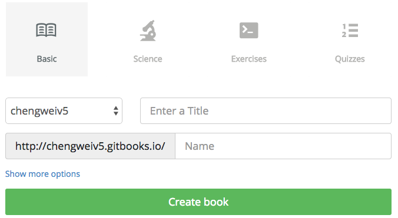

# 新建書籍

要使用 GitBook.com 來託管你的書籍，首先需要註冊一個賬號，免費註冊後，用戶也可以選擇升級為付費用戶，享受更多的服務！

登陸 [GitBook.com](https://www.gitbook.com) 後，在用戶頁面，可以管理現有書籍以及創建新的書籍，如下圖：

點擊 "+ Create a new book" 後，跳轉到新建書籍頁面，如下圖：

目前有 4 中書籍主題可以選擇，這裡以默認的 `Basic` 主題為例，輸入書籍名字後，點擊 "Create book"，完成書籍的創建。

創建完成後，就會進入書籍屬性頁面，如下圖所示：

這裡可以進行對書籍的各個屬性進行配置，例如：

- 編輯書籍（Edit Book）
- 書籍主題（Theme）
- 綁定 GitHub（GitHub）
- 綁定域名（Domain Names）

等。

以上幾個配置將在後面介紹，其它的配置比較簡單，請讀者自行探索！
